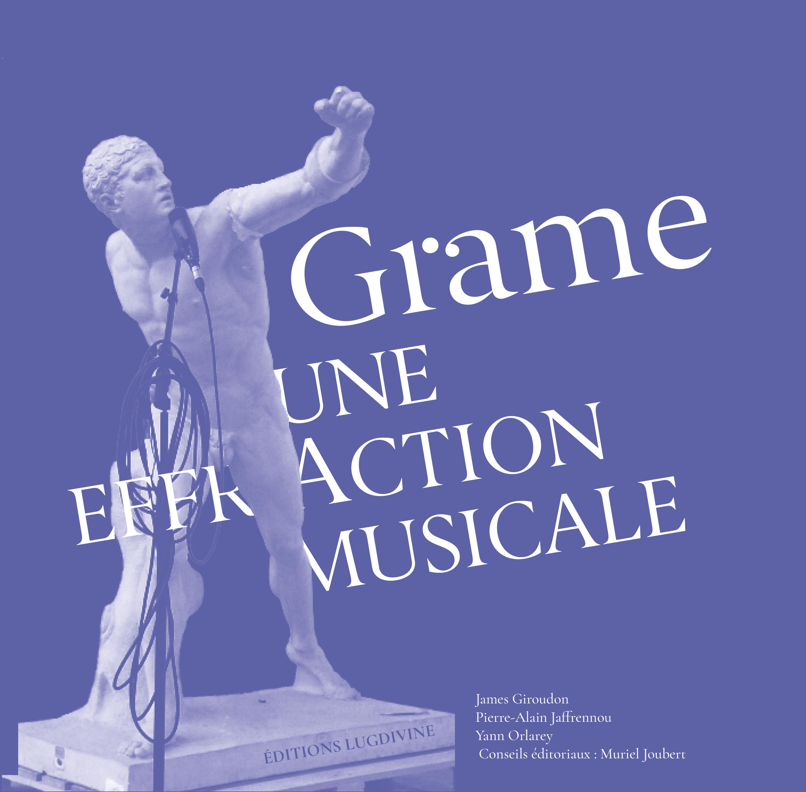

En quatre actes, une ouverture et un épilogue, suivis de quelques propos et pages énumératives, le récit de Grame, une effraction musicale, qui se déroule sur près de quatre décennies, s’affiche pleinement en interconnexions avec les mutations technologiques et sociétales. Musiques installées, en scène ou embarquées... en phase avec la grande échappée du sonore marquant le XXème siècle... au cœur de la révolution numérique, Grame s’est rapidement imposé comme acteur dans le champ de l’innovation musicale et scientifique en portant la création dans ses multiples confins pluridisciplinaires. Cet ouvrage en brosse les grandes étapes et témoigne des concepts qui ont porté Grame tout au long de ce parcours.

_Auteurs : James Giroudon, Pierre-Alain Jaffrennou, Yann Orlarey._
_Conseils éditoriaux : Muriel Joubert._
_550 pages, 350 photos et illustrations._
_Editions Lugdivine. 35 euros._

<a href="./extrait.pdf" >
	<button style="background-color: rgb(170,90,98); border:none; color: rgb(240,240,240); height:50px; width:200px; margin-top:30px; margin-bottom:4px; margin-left:auto; margin-right:auto; display: block; border-radius: 2px;"> 
		Lire un extrait
	</button>
</a>
<a href="./communique-presse.pdf" >
	<button style="background-color: rgb(157,93,157); border:none; color: rgb(240,240,240); height:50px; width:200px; margin-top:4px; margin-bottom:4px; margin-left:auto; margin-right:auto; display: block; border-radius: 2px;"> 
		Lire le communiqué
	</button>
</a>
<a href="https://docs.google.com/forms/d/e/1FAIpQLScLCjXs3Xj6-VtVk2xyAWq1rQXPHhnaoTciAwInFju_6_AsmA/viewform" >
	<button style="background-color: rgb(90,98,170); border:none; color: rgb(240,240,240); height:50px; width:200px; margin-top:4px; margin-bottom:10px; margin-left:auto; margin-right:auto;  display: block; border-radius: 2px;"> 
		Commander le livre
	</button>
</a>

<a href="./presss/diapason.jpeg" >
	<button style="background-color: rgb(205,92,92); border:none; color: rgb(240,240,240); height:50px; width:200px; margin-top:4px; margin-bottom:10px; margin-left:auto; margin-right:auto;  display: block; border-radius: 2px; position: fixed; top: 20px;right: 20px;"> 
		::Diapason
	</button>
</a>

<a href="./presss/hemisphereson.jpeg" >
	<button style="background-color: rgb(205,92,92); border:none; color: rgb(240,240,240); height:50px; width:200px; margin-top:4px; margin-bottom:10px; margin-left:auto; margin-right:auto;  display: block; border-radius: 2px; position: fixed; top: 80px;right: 20px;"> 
		::Hémisphère Son
	</button>
</a>

<a href="./presss/musicologies.jpeg" >
	<button style="background-color: rgb(205,92,92); border:none; color: rgb(240,240,240); height:50px; width:200px; margin-top:4px; margin-bottom:10px; margin-left:auto; margin-right:auto;  display: block; border-radius: 2px; position: fixed; top: 140px;right: 20px;"> 
		::Musicologies Nouvelles
	</button>
</a>

