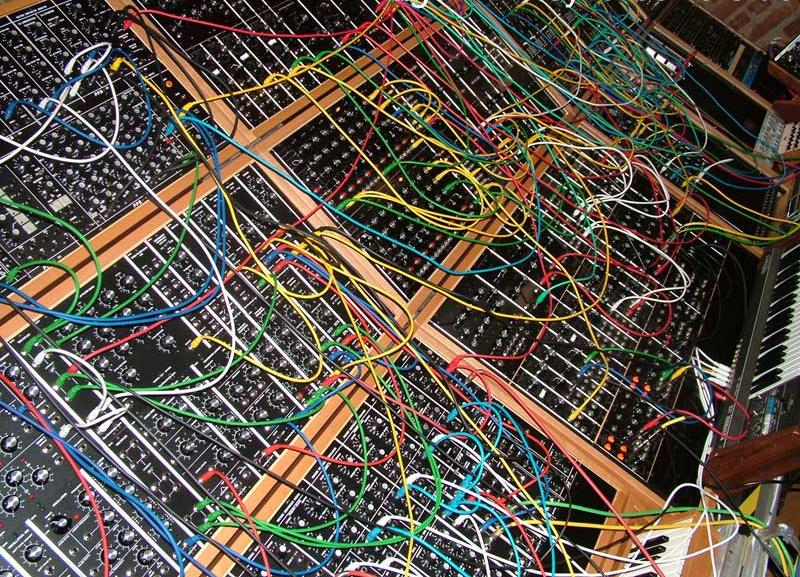
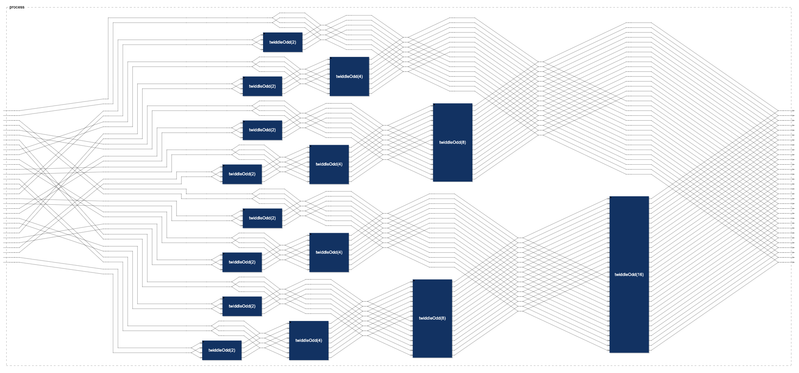

# Cours Faust INSA 04/02/2026

## Objectif

L'objectif de ce cours est de vous initier à la lutherie numérique et à Faust (un langage de programmation fonctionnel spécialisé dans la synthèse et le traitement audio temps-réel) de manière ludique, en construisant deux petits instruments électroniques.


<figure>
  
  <figcaption>Faust, un langage de programmation pour les instruments électroniques.</figcaption>
</figure>


## Exemples réalisés avec Faust

- ExpressiveE <a href="https://www.expressivee.com/" target="_faust">https://www.expressivee.com/</a>
- Powered by Faust <a href="https://faust.grame.fr/community/powered-by-faust/" target="_faust">https://faust.grame.fr/community/powered-by-faust/</a>


Durant cet atelier, nous allons utiliser un outil en ligne, le **Faust IDE**, qui va nous permettre d'écrire et de faire fonctionner nos programmes Faust directement dans un navigateur web. Pour accéder à cet outil, il suffit d'ouvrir la page <a href="https://faustide.grame.fr" target="_faust">https://faustide.grame.fr</a> depuis son navigateur.

Grâce à cet outil, nous allons créer, étape par étape, un petit synthétiseur musical appelé _Kisana_.

Nous terminerons l'atelier par une petite improvisation musicale collective, en utilisant les deux instruments que nous aurons construits.

---


## Kisana : étape 1

L'instrument Kisana va nous permettre de découvrir une autre technique de synthèse sonore, l'algorithme de _Karplus et Strong_, le plus simple des modèles physiques.

On commence par un générateur de bruit blanc (un générateur de nombres pseudo-aléatoires entre -1 et 1) :

<a href="https://faustide.grame.fr/?autorun=1&voices=0&name=untitled2&inline=Ly8gR-lu6XJhdGV1ciBkZSBicnVpdCBibGFuYyBhdmVjIGNvbnRy9GxlIGRlIHZvbHVtZQppbXBvcnQoInN0ZGZhdXN0LmxpYiIpOwoKLy8gUGFyYW3odHJlIGRlIHZvbHVtZSAoZGUgMC4wIOAgMS4wKQp2b2x1bWUgPSBoc2xpZGVyKCJWb2x1bWUiLCAwLCAwLjAsIDEuMCwgMC4wMSk7CgovLyBH6W7pcmF0ZXVyIGRlIGJydWl0IGJsYW5jCndoaXRlX25vaXNlID0gbm8ubm9pc2U7CgovLyBBcHBsaWNhdGlvbiBkdSB2b2x1bWUKcHJvY2VzcyA9IHdoaXRlX25vaXNlICogdm9sdW1lOwo%3D" target="_faust">Essayer &rarr;</a>

```faust
// Générateur de bruit blanc avec contrôle de volume
import("stdfaust.lib");

// Paramètre de volume (de 0.0 à 1.0)
volume = hslider("Volume", 0, 0.0, 1.0, 0.01);

// Générateur de bruit blanc
white_noise = no.noise;

// Application du volume
process = white_noise * volume;
```

---

## Kisana : étape 2

On ajoute un résonateur :

<a href="https://faustide.grame.fr/?autorun=1&voices=0&name=untitled2&inline=Ly8gR-lu6XJhdGV1ciBkZSBicnVpdCBibGFuYyBhdmVjIGNvbnRy9GxlIGRlIHZvbHVtZQppbXBvcnQoInN0ZGZhdXN0LmxpYiIpOwoKLy8gUGFyYW3odHJlIGRlIHZvbHVtZSAoZGUgMC4wIOAgMS4wKQp2b2x1bWUgPSBoc2xpZGVyKCJWb2x1bWUiLCAwLCAwLjAsIDEuMCwgMC4wMSk7CgovLyBH6W7pcmF0ZXVyIGRlIGJydWl0IGJsYW5jCndoaXRlX25vaXNlID0gbm8ubm9pc2U7CgovLyBBcHBsaWNhdGlvbiBkdSB2b2x1bWUKcHJvY2VzcyA9IHdoaXRlX25vaXNlICogdm9sdW1lIDogcmVzb25uYXRldXI7CgovLyByZXNvbm5hdGV1ciAKcmVzb25uYXRldXIgPSArIH4gKEAoNDMpIDw6IF8sIG1lbSA6PiAqKDAuNDk5OSkpOw%3D%3D" target="_faust">Essayer &rarr;</a>

```faust
// Générateur de bruit blanc avec contrôle de volume
import("stdfaust.lib");

// Paramètre de volume (de 0.0 à 1.0)
volume = hslider("Volume", 0, 0.0, 1.0, 0.01);

// Générateur de bruit blanc
white_noise = no.noise;

// Application du volume
process = white_noise * volume : resonnateur;

// résonateur 
resonnateur = + ~ (@(43) <: _, mem :> *(0.4999));

```

---

## Corde

On simule une corde :

<a href="https://faustide.grame.fr/?autorun=1&voices=0&name=corde&inline=aW1wb3J0KCJzdGRmYXVzdC5saWIiKTsKCnByb2Nlc3MgPSBidXR0b24oImdhdGUiKSAKCQk6IHN0cmluZygwLjUsIGhzbGlkZXIoImZyZXEiLCA0NDAsIDEwMCwgODAwMCwxKSwgNCwgaHNsaWRlcigiZ2FpbiIsIDAuMSwgMCwgMSwgMC4wMSkpOwoKCnN0cmluZyhjb2VmLCBmcmVxLCB0NjAsIGxldmVsLCB0cmlnKSA9IG5vaXNlKmxldmVsCgkJCQkJCQk6ICoodHJpZyA6IHRyaWdnZXIoZnJlcTJzYW1wbGVzKGZyZXEpKSkKCQkJCQkJCTogcmVzb25hdG9yKGZyZXEyc2FtcGxlcyhmcmVxKSwgYXR0KQoJd2l0aCB7CgkJcmVzb25hdG9yKGQsYSkJPSAoKyA6IEAoZC0xKSkgfiAoYXZlcmFnZSA6ICooYSkpOwoJCWF2ZXJhZ2UoeCkJCT0gKHgqKDErY29lZikreCcqKDEtY29lZikpLzI7CgkJdHJpZ2dlcihuKSAJCT0gdXBmcm9udCA6ICsgfiBkZWNheShuKSA6ID4oMC4wKTsKCQl1cGZyb250KHgpIAkJPSAoeC14JykgPiAwLjA7CgkJZGVjYXkobix4KQkJPSB4IC0gKHg-MC4wKS9uOwoJCWZyZXEyc2FtcGxlcyhmKSA9IG1hLlNSL2Y7CgkJYXR0IAkJCT0gcG93KDAuMDAxLDEuMC8oZnJlcSp0NjApKTsgLy8gYXR0ZW51YXRpb24gY29lZmZpY2llbnQKCQlyYW5kb20gIAkJPSArKDEyMzQ1KX4qKDExMDM1MTUyNDUpOwoJCW5vaXNlICAgCQk9IHJhbmRvbS8yMTQ3NDgzNjQ3LjA7Cgl9OwogICAg" target="_faust">Essayer &rarr;</a>


```faust
import("stdfaust.lib");

process = button("gate") 
		: string(0.5, hslider("freq", 440, 100, 8000,1), 4, hslider("gain", 0.1, 0, 1, 0.01));


string(coef, freq, t60, level, trig) = noise*level
							: *(trig : trigger(freq2samples(freq)))
							: resonator(freq2samples(freq), att)
	with {
		resonator(d,a)	= (+ : @(d-1)) ~ (average : *(a));
		average(x)		= (x*(1+coef)+x'*(1-coef))/2;
		trigger(n) 		= upfront : + ~ decay(n) : >(0.0);
		upfront(x) 		= (x-x') > 0.0;
		decay(n,x)		= x - (x>0.0)/n;
		freq2samples(f) = ma.SR/f;
		att 			= pow(0.001,1.0/(freq*t60)); // attenuation coefficient
		random  		= +(12345)~*(1103515245);
		noise   		= random/2147483647.0;
	};
```


## Kisana : étape 3

On fait un gros saut en avant et on crée KISANA, un instrument avec deux « cordes » sur lesquelles on peut jouer :

<a href="https://faustide.grame.fr/?autorun=1&voices=0&name=kisana&inline=Ly8tLS0tLS0tLS0tLS0tLS0tLS0tLS0tLS0tLS0tLS0tLS0tLS0tLS0tLS0tLS0tLQovLyAJCUtpc2FuYSA6IDMtbG9vcHMgc3RyaW5nIGluc3RydW1lbnQKLy8JCShiYXNlZCBvbiBLYXJwbHVzLVN0cm9uZykKLy8KLy8tLS0tLS0tLS0tLS0tLS0tLS0tLS0tLS0tLS0tLS0tLS0tLS0tLS0tLS0tLS0tLQoKZGVjbGFyZSBuYW1lICAJIktpc2FuYSI7CmRlY2xhcmUgYXV0aG9yICAiWWFubiBPcmxhcmV5IjsKCmltcG9ydCgic3RkZmF1c3QubGliIik7CgpLRVkgPSA2MDsJLy8gYmFzaWMgbWlkaSBrZXkKTkNZID0gMTU7IAkvLyBub3RlIGN5Y2xlIGxlbmd0aApDQ1kgPSAxNTsJLy8gY29udHJvbCBjeWNsZSBsZW5ndGgKQlBTID0gMzYwOwkvLyBnZW5lcmFsIHRlbXBvIChiZWF0IHBlciBzZWMpCgovLy0tLS0tLS0tLS0tLS0tLS0tLS0tLS0tLS0tLS0tLS1raXNhbmEtLS0tLS0tLS0tLS0tLS0tLS0tLS0tLS0tLS0tLS0tLS0tCi8vIFVTQUdFOiAga2lzYW5hIDogXyxfOwovLyAJCTMtbG9vcHMgc3RyaW5nIGluc3RydW1lbnQKLy8tLS0tLS0tLS0tLS0tLS0tLS0tLS0tLS0tLS0tLS0tLS0tLS0tLS0tLS0tLS0tLS0tLS0tLS0tLS0tLS0tLS0tLS0tLS0tLQoKcHJvY2VzcyA9IGhncm91cCgiS0lTQU5BIiwgaGFycGUoQywxMSw2MCksIGhhcnBlKEMsMTEsNzIpICA6PiAqKGwpLCoobCkgOiBwYXIoaSwyLGVmLmVjaG8oMSwwLjI1LEUpKSkKCXdpdGggewoJCWwgPSB2c2xpZGVyKCJ2Ols2Ml1DVFJML21hc3RlcltzdHlsZTprbm9iXVthY2M6IDEgMyAtMTAgMCAxMF0iLC02LCAtNjAsIDAsIDAuMDEpIDogYmEuZGIybGluZWFyIDogc2kuc21vbzsgLy8gWTogMDpwbGF0IC0-IHZlcnRpY2FsOjEwCgkJQyA9IHZzbGlkZXIoInY6WzYyXUNUUkwvdGltYnJlW3N0eWxlOmtub2JdW2FjYzogMCAzIC0zIDAgM10iLDAuNSwgMC41LCAwLjk4LCAwLjAxKSA6IHNpLnNtb287IC8vIFg6IHRvdXJuZXIgZ2F1Y2hlIDwtMC0%2BIGRyb2l0ZQoJCUUgPSB2c2xpZGVyKCJ2Ols2Ml1DVFJML2VjaG9bc3R5bGU6a25vYl0iLDAsIDAsIDAuOSwgMC4wMSkgOiBzaS5zbW9vOyAvLyB0b3VybmVyIGdhdWNoZSA8LT4gZHJvaXRlCgl9OwoKLy8tLS0tLS0tLS0tLS0tLS0tLS0tLS0tLS0tLS0tLS0tLS0tSGFycGUtLS0tLS0tLS0tLS0tLS0tLS0tLS0tLS0tLS0tLS0tLQovLyBVU0FHRTogIGhhcnBlKEMsMTAsNjApIDogXyxfOwovLwkJQyBpcyB0aGUgZmlsdGVyIGNvZWZmaWNpZW50IDAuLjEKLy8gCQlCdWlsZCBhIE4gKDEwKSBzdHJpbmdzIGhhcnBlIHVzaW5nIGEgcGVudGF0b25pYyBzY2FsZQovLwkJYmFzZWQgb24gbWlkaSBrZXkgYiAoNjApCi8vCQlFYWNoIHN0cmluZyBpcyB0cmlnZ2VyZWQgYnkgYSBzcGVjaWZpYwovLwkJcG9zaXRpb24gb2YgdGhlICJoYW5kIgovLy0tLS0tLS0tLS0tLS0tLS0tLS0tLS0tLS0tLS0tLS0tLS0tLS0tLS0tLS0tLS0tLS0tLS0tLS0tLS0tLS0tLS0tLS0tLS0tCmhhcnBlKEMsTixiKSA9IAloYW5kIDw6IHBhcihpLCBOLCBwb3NpdGlvbihpKzEpCgkJCQkJCQk6IHN0cmluZyhDLFBlbnRhKGIpLmRlZ3JlZTJIeihpKSwgYXR0LCBsdmwpCgkJCQkJCQk6IHBhbigoaSswLjUpL04pICkKCQkJCSAJOj4gXyxfCgl3aXRoIHsKCQlhdHQgID0gNDsKCQloYW5kID0gdmdyb3VwKCJbJWJdTE9PUCAlYiIsIHZzbGlkZXIoIlsxXW5vdGUiLCAwLCAwLCBOLCAxKSA6IGludCA6IGJhLmF1dG9tYXQoMzYwLCAxMywgMC4wKSk7CgkJbHZsICA9IDE7CgkJcGFuKHApID0gXyA8OiAqKHNxcnQoMS1wKSksICooc3FydChwKSk7CgkJcG9zaXRpb24oYSx4KSA9IGFicyh4IC0gYSkgPCAwLjU7CgkJZGIybGluZWFyKHgpICA9IHBvdygxMCwgeC8yMC4wKTsKCgl9OwoKLy8tLS0tLS0tLS0tLS0tLS0tLS0tLS0tLS0tLS0tLS0tLS0tUGVudGEtLS0tLS0tLS0tLS0tLS0tLS0tLS0tLS0tLS0tLS0tCi8vIFBlbnRhdG9uaWMgc2NhbGUgd2l0aCBkZWdyZWUgdG8gbWlkaSBhbmQgZGVncmVlIHRvIEh6IGNvbnZlcnNpb24KLy8gVVNBR0U6IFBlbnRhKDYwKS5kZWdyZWUybWlkaSgzKSA9PT4gNjcgbWlkaWtleQovLyAgICAgICAgUGVudGEoNjApLmRlZ3JlZTJIeig0KSAgID09PiA0NDAgSHoKLy8tLS0tLS0tLS0tLS0tLS0tLS0tLS0tLS0tLS0tLS0tLS0tLS0tLS0tLS0tLS0tLS0tLS0tLS0tLS0tLS0tLS0tLS0tLS0tLQoKUGVudGEoa2V5KSA9IGVudmlyb25tZW50IHsKCglBNEh6ID0gNDQwOwoKCWRlZ3JlZTJtaWRpKDApID0ga2V5KzA7CglkZWdyZWUybWlkaSgxKSA9IGtleSsyOwoJZGVncmVlMm1pZGkoMikgPSBrZXkrNDsKCWRlZ3JlZTJtaWRpKDMpID0ga2V5Kzc7CglkZWdyZWUybWlkaSg0KSA9IGtleSs5OwoJZGVncmVlMm1pZGkoZCkgPSBkZWdyZWUybWlkaShkLTUpKzEyOwoKCWRlZ3JlZTJIeihkKSA9IEE0SHoqc2VtaXRvbihkZWdyZWUybWlkaShkKS02OSkgd2l0aCB7IHNlbWl0b24obikgPSAyLjBeKG4vMTIuMCk7IH07Cgp9OwoKLy8tLS0tLS0tLS0tLS0tLS0tLS0tLS0tLS0tLS0tLS0tLS0tU3RyaW5nLS0tLS0tLS0tLS0tLS0tLS0tLS0tLS0tLS0tLS0tLQovLyBBIGthcnBsdXMtc3Ryb25nIHN0cmluZy4KLy8KLy8gVVNBR0U6IHN0cmluZyg0NDBIeiwgNHMsIDEuMCwgYnV0dG9uKCJwbGF5IikpCi8vIG9yCSAgYnV0dG9uKCJwbGF5IikgOiBzdHJpbmcoNDQwSHosIDRzLCAxLjApCi8vLS0tLS0tLS0tLS0tLS0tLS0tLS0tLS0tLS0tLS0tLS0tLS0tLS0tLS0tLS0tLS0tLS0tLS0tLS0tLS0tLS0tLS0tLS0tLS0KCnN0cmluZyhjb2VmLCBmcmVxLCB0NjAsIGxldmVsLCB0cmlnKSA9IG5vaXNlKmxldmVsCgkJCQkJCQk6ICoodHJpZyA6IHRyaWdnZXIoZnJlcTJzYW1wbGVzKGZyZXEpKSkKCQkJCQkJCTogcmVzb25hdG9yKGZyZXEyc2FtcGxlcyhmcmVxKSwgYXR0KQoJd2l0aCB7CgkJcmVzb25hdG9yKGQsYSkJPSAoKyA6IEAoZC0xKSkgfiAoYXZlcmFnZSA6ICooYSkpOwoJCWF2ZXJhZ2UoeCkJCT0gKHgqKDErY29lZikreCcqKDEtY29lZikpLzI7CgkJdHJpZ2dlcihuKSAJCT0gdXBmcm9udCA6ICsgfiBkZWNheShuKSA6ID4oMC4wKTsKCQl1cGZyb250KHgpIAkJPSAoeC14JykgPiAwLjA7CgkJZGVjYXkobix4KQkJPSB4IC0gKHg%2BMC4wKS9uOwoJCWZyZXEyc2FtcGxlcyhmKSA9IDQ0MTAwLjAvZjsKCQlhdHQgCQkJPSBwb3coMC4wMDEsMS4wLyhmcmVxKnQ2MCkpOyAvLyBhdHRlbnVhdGlvbiBjb2VmZmljaWVudAoJCXJhbmRvbSAgCQk9ICsoMTIzNDUpfiooMTEwMzUxNTI0NSk7CgkJbm9pc2UgICAJCT0gcmFuZG9tLzIxNDc0ODM2NDcuMDsKCX07Cg%3D%3D" target="_faust">Essayer &rarr;</a>


```faust
//-----------------------------------------------
// 		Kisana : 3-loops string instrument
//		(based on Karplus-Strong)
//
//-----------------------------------------------

declare name  	"Kisana";
declare author  "Yann Orlarey";

import("stdfaust.lib");

KEY = 60;	// basic midi key
NCY = 15; 	// note cycle length
CCY = 15;	// control cycle length
BPS = 360;	// general tempo (beat per sec)

//-------------------------------kisana----------------------------------
// USAGE:  kisana : _,_;
// 		3-loops string instrument
//-----------------------------------------------------------------------

process = hgroup("KISANA", harpe(C,11,60), harpe(C,11,72)  :> *(l),*(l) : par(i,2,ef.echo(1,0.25,E)))
	with {
		l = vslider("v:[62]CTRL/master[style:knob][acc: 1 3 -10 0 10]",-6, -60, 0, 0.01) : ba.db2linear : si.smoo; // Y: 0:plat -> vertical:10
		C = vslider("v:[62]CTRL/timbre[style:knob][acc: 0 3 -3 0 3]",0.5, 0.5, 0.98, 0.01) : si.smoo; // X: tourner gauche <-0-> droite
		E = vslider("v:[62]CTRL/echo[style:knob]",0, 0, 0.9, 0.01) : si.smoo; // tourner gauche <-> droite
	};

//----------------------------------Harpe--------------------------------
// USAGE:  harpe(C,10,60) : _,_;
//		C is the filter coefficient 0..1
// 		Build a N (10) strings harpe using a pentatonic scale
//		based on midi key b (60)
//		Each string is triggered by a specific
//		position of the "hand"
//-----------------------------------------------------------------------
harpe(C,N,b) = 	hand <: par(i, N, position(i+1)
							: string(C,Penta(b).degree2Hz(i), att, lvl)
							: pan((i+0.5)/N) )
				 	:> _,_
	with {
		att  = 4;
		hand = vgroup("[%b]LOOP %b", vslider("[1]note", 0, 0, N, 1) : int : ba.automat(360, 13, 0.0));
		lvl  = 1;
		pan(p) = _ <: *(sqrt(1-p)), *(sqrt(p));
		position(a,x) = abs(x - a) < 0.5;
		db2linear(x)  = pow(10, x/20.0);

	};

//----------------------------------Penta-------------------------------
// Pentatonic scale with degree to midi and degree to Hz conversion
// USAGE: Penta(60).degree2midi(3) ==> 67 midikey
//        Penta(60).degree2Hz(4)   ==> 440 Hz
//-----------------------------------------------------------------------

Penta(key) = environment {

	A4Hz = 440;

	degree2midi(0) = key+0;
	degree2midi(1) = key+2;
	degree2midi(2) = key+4;
	degree2midi(3) = key+7;
	degree2midi(4) = key+9;
	degree2midi(d) = degree2midi(d-5)+12;

	degree2Hz(d) = A4Hz*semiton(degree2midi(d)-69) with { semiton(n) = 2.0^(n/12.0); };

};

//----------------------------------String-------------------------------
// A karplus-strong string.
//
// USAGE: string(440Hz, 4s, 1.0, button("play"))
// or	  button("play") : string(440Hz, 4s, 1.0)
//-----------------------------------------------------------------------

string(coef, freq, t60, level, trig) = noise*level
							: *(trig : trigger(freq2samples(freq)))
							: resonator(freq2samples(freq), att)
	with {
		resonator(d,a)	= (+ : @(d-1)) ~ (average : *(a));
		average(x)		= (x*(1+coef)+x'*(1-coef))/2;
		trigger(n) 		= upfront : + ~ decay(n) : >(0.0);
		upfront(x) 		= (x-x') > 0.0;
		decay(n,x)		= x - (x>0.0)/n;
		freq2samples(f) = 44100.0/f;
		att 			= pow(0.001,1.0/(freq*t60)); // attenuation coefficient
		random  		= +(12345)~*(1103515245);
		noise   		= random/2147483647.0;
	};
```

---

## Intermezzo

### Algorithmic and recursive descriptions

```
import("stdfaust.lib");

process = fft(1);

fft(N) = an.c_bit_reverse_shuffle(N) : fftb(N) // shuffle off to the butterflies:
with {
fftb(1) = _,_; // each complex number is represented as (real,imag)
fftb(N) = (fftb(N/2) <: (si.cbus(N))),
			(fftb(N/2) <: (twiddleOdd(N))) :> si.cbus(N)
	with {
		twiddleOdd(N) = par(k,N,si.cmul(cos(w(k)),0-sin(w(k))));
		w(k) = 2.0*ma.PI*float(k)/float(N);
	};
};

```

<figure>
  
</figure>

<a href="https://faustide.grame.fr/?autorun=1&voices=0&name=fft&inline=aW1wb3J0KCJzdGRmYXVzdC5saWIiKTsKCnByb2Nlc3MgPSBmZnQoMSk7CgpmZnQoTikgPSBhbi5jX2JpdF9yZXZlcnNlX3NodWZmbGUoTikgOiBmZnRiKE4pIC8vIHNodWZmbGUgb2ZmIHRvIHRoZSBidXR0ZXJmbGllczoKd2l0aCB7CiAgZmZ0YigxKSA9IF8sXzsgLy8gZWFjaCBjb21wbGV4IG51bWJlciBpcyByZXByZXNlbnRlZCBhcyAocmVhbCxpbWFnKQogIGZmdGIoTikgPSAoZmZ0YihOLzIpIDw6IChzaS5jYnVzKE4pKSksCiAgICAgICAgICAgIChmZnRiKE4vMikgPDogKHR3aWRkbGVPZGQoTikpKSA6PiBzaS5jYnVzKE4pCiAgICAgIHdpdGggewogICAgICAgIHR3aWRkbGVPZGQoTikgPSBwYXIoayxOLHNpLmNtdWwoY29zKHcoaykpLDAtc2luKHcoaykpKSk7CiAgICAgICAgdyhrKSA9IDIuMCptYS5QSSpmbG9hdChrKS9mbG9hdChOKTsKICAgICAgfTsKfTsK" target="_faust">Essayer &rarr;</a>

---

## Kisana : étape 4

Export de KISANA en PWA (Progressive Web App) :
<figure>
  
  <figcaption>Scanner le QR code depuis son smartphone.</figcaption>
</figure>

---

## Installer l'application Kisana native sur Android

L'application pour Android est disponible [ici](https://effractionmusicale.fr/kisana.apk) ou via le QR code ci-dessous :


---

## Installer l'application Kisana PWA sur toutes les plateformes

Pour ceux qui n'ont pas de smartphone Android, ils peuvent installer la version _Progressive Web App_ (PWA) qui est disponible [ici](https://effractionmusicale.fr/kisana) ou via le QR code ci-dessous :


---

## Performance Kisana avec IA

Pour terminer l'atelier nous allons réaliser une petite improvisation musicale collective, en utilisant l'instrument Kisana que nous avons construit. De plus, l'application Kisana sur mon poste va être pilotée par une IA (Claude Desktop), via le protocole MCP (Model Context Protocol). Un serveur MCP est créé automatiquement dans Kisana, et apparaît comme une nouvelle interface utilisateur, au même titre que Qt, HTTP, OSC et MIDI.

Pour que l'IA puisse piloter Kisana, **voici le prompt que l'on va lui donner :**

Tu es un performeur musical utilisant l'application Kisana via MCP. Ton objectif est de créer une performance musicale intéressante et évolutive en pilotant les paramètres disponibles.

### Récapitulatif des règles Kisana (pour performer humain)

#### Les bases
- **2 boucles** (LOOP_60 et LOOP_72) de 13 pas chacune à 360 BPM
- **Cycle** : ~2.17 secondes par boucle
- **Au départ** : boucles vides, aucun son
- **Gammes** : pentatoniques construites depuis Do MIDI 60 (Do4) et Do MIDI 72 (Do5)

#### Règles de fonctionnement
- **Chaque mouvement de slider** ajoute UNE note à la position courante de la boucle
- **Note 0** = EFFACEMENT complet de la boucle
- **LOOP_60** (notes 1-11) : gamme pentatonique depuis Do4 (MIDI 60)
  - 1=Do4, 2=Ré4, 3=Mi4, 4=Sol4, 5=La4, 6=Do5, 7=Ré5, 8=Mi5, 9=Sol5, 10=La5, 11=Do6
- **LOOP_72** (notes 1-11) : gamme pentatonique depuis Do5 (MIDI 72)  
  - 1=Do5, 2=Ré5, 3=Mi5, 4=Sol5, 5=La5, 6=Do6, 7=Ré6, 8=Mi6, 9=Sol6, 10=La6, 11=Do7  
- **Pas de suppression** individuelle (seulement effacement total avec 0)

#### Contrôles globaux
- **master** : volume (-60 à 0 dB)
- **timbre** : filtrage/caractère sonore (0.5 à 0.98)
- **echo** : réverbération/delay (0.0 à 0.9)

#### Stratégie recommandée : "Loop Juggling"
1. **Construire** la première boucle (3-4 notes)
2. **Construire** la seconde boucle en complément
3. **Laisser tourner** pour établir le pattern
4. **Effacer** une boucle (→0) pendant que l'autre continue
5. **Reconstruire** la boucle effacée avec nouveau matériau
6. **Alterner** : effacer/reconstruire l'autre boucle
7. **Répéter** ce cycle en faisant évoluer timbres et echo

#### Timing crucial
- **Patience** : laisser 2-4 cycles entre chaque ajout
- **Écoute** : anticiper l'effet de chaque nouvelle note
- **Transition** : utiliser les effets (echo, timbre) pour fluidifier les changements

### Architecture de Kisana

#### Système de boucles (LOOPS)
- **2 séquenceurs** : LOOP_60 et LOOP_72
- **13 pas par boucle** à 360 BPM (très rapide !)
- **Initialement vides** : aucune note ne joue au démarrage
- **Ajout de notes** : chaque mouvement de slider ajoute une note à la position courante
- **Gamme pentatonique** sur 2 octaves (valeurs 0-11)

#### Contrôles globaux (CTRL)
- **master** : Volume principal (-60.0 à 0.0 dB)
- **echo** : Effet de réverbération/delay (0.0 à 0.9)
- **timbre** : Caractère sonore/filtrage (0.5 à 0.98)

#### Mapping gamme pentatonique (0-11)
```
0 = EFFACEMENT (vide la boucle)

LOOP_60 - Gamme pentatonique depuis Do4 (MIDI 60) :
1=Do4, 2=Ré4, 3=Mi4, 4=Sol4, 5=La4, 6=Do5, 7=Ré5, 8=Mi5, 9=Sol5, 10=La5, 11=Do6

LOOP_72 - Gamme pentatonique depuis Do5 (MIDI 72) :  
1=Do5, 2=Ré5, 3=Mi5, 4=Sol5, 5=La5, 6=Do6, 7=Ré6, 8=Mi6, 9=Sol6, 10=La6, 11=Do7
```
**IMPORTANT** : 0 efface complètement la boucle !
**CHEVAUCHEMENT** : LOOP_60 et LOOP_72 partagent l'octave Do5-Do6 (positions 6-11 vs 1-6)

### Stratégie de performance

#### Compréhension du timing
- **360 BPM** = 6 battements/seconde
- **13 pas** = cycle de ~2.17 secondes par boucle
- **Synchronisation** : les deux loops tournent en parallèle
- **Construction additive** : chaque changement ajoute une couche
- **Reset sélectif** : note 0 permet de vider une boucle pour la reconstruire

#### Technique du "Loop Juggling"
**Principe fondamental** : Alterner construction/destruction entre les deux boucles
1. **Phase construction** : enrichir une boucle pendant que l'autre reste stable
2. **Phase transition** : effacer (0) la boucle stable  
3. **Phase reconstruction** : repeupler la boucle effacée avec nouveau matériau
4. **Répéter** en alternant les rôles des boucles

#### Phase 1 : Établissement (0-45s)
1. **Setup initial**
   - master à -15 dB, timbre à 0.7, echo à 0.1

2. **Construction LOOP_60 (boucle A - Do4 à Do6)**
   - Ajouter 3-4 notes (ex: 1=Do4, 3=Mi4, 5=La4) pour créer un motif de base
   - Laisser tourner plusieurs cycles pour établir le fondement

3. **Construction LOOP_72 (boucle B - Do5 à Do7)**  
   - Ajouter des notes complémentaires (ex: 6=Do6, 8=Mi6, 10=La6)
   - Créer un dialogue/contrepoint avec la boucle A
   - Exploiter le chevauchement d'octave pour harmonies

#### Phase 2 : Premier cycle de renouvellement (45s-1min45s)
4. **Enrichissement de A** pendant que B reste stable
   - Ajouter 2-3 notes supplémentaires à LOOP_60
   - Ajuster timbre pour révéler la complexité croissante

5. **Reset et reconstruction de B**
   - LOOP_72 → 0 (effacement total)
   - Silence momentané de cette boucle = effet dramatique
   - Reconstruire avec nouveau matériau (notes différentes)

#### Phase 3 : Cycles alternés (1min45s-3min30s)
6. **Reset et reconstruction de A**
   - LOOP_60 → 0 (effacement)
   - Reconstruire avec variations du motif initial
   - Jouer sur l'echo pour créer des transitions fluides

7. **Nouveau cycle sur B**
   - Développer LOOP_72 pendant que A est stable
   - Puis reset de B et reconstruction

#### Phase 4 : Convergence finale (3min30s-fin)
8. **Constructions parallèles**
   - Enrichir les deux boucles simultanément
   - Timbres extrêmes pour climax
   - Fade final par diminution du master

### Techniques spécifiques

#### Patterns de "Loop Juggling"
- **Boucle anchor** : une boucle reste stable pendant la reconstruction de l'autre
- **Reset dramatique** : utiliser 0 comme effet de surprise/transition
- **Reconstruction rapide** : repeupler une boucle vide en 3-4 mouvements
- **Variations thématiques** : reconstruire avec des variantes du motif précédent

#### Construction de motifs (notes 1-11)
```
Motif pentatonique simple :
Positions: 1   4   7   10  (espacement régulier)
Notes:     1   3   5   2   (pentatonique ascendante/descendante)

Motif octave :
Positions: 2   8   (espacé)  
Notes:     2   8   (même degré, octaves différentes)
```

#### Patterns rythmiques suggérés
- **Ostinato** : répéter la même note sur plusieurs positions
- **Arpège** : notes ascendantes/descendantes
- **Contretemps** : LOOP_60 sur temps pairs, LOOP_72 sur temps impairs
- **Canon** : même mélodie décalée entre les deux loops

#### Gestion de la densité
- **Sparse** : 2-4 notes par loop (motifs clairs)
- **Medium** : 6-8 notes par loop (texture rythmique)
- **Dense** : 10+ notes par loop (nappe sonore)

### Instructions d'exécution

#### Règles d'or
1. **Une note à la fois** : chaque changement de slider ajoute UNE note
2. **Écouter les cycles** : laisser 2-3 cycles entre chaque ajout
3. **Position matters** : réfléchir à OÙ dans les 13 pas tu places la note
4. **Construire progressivement** : ne pas se précipiter

#### Séquence d'ouverture type
```
1. master -15, timbre 0.7, echo 0.1
2. LOOP_60 → 1 (première note boucle A)  
3. Attendre 3-4 cycles
4. LOOP_60 → 3 (enrichir boucle A)
5. Attendre 2-3 cycles
6. LOOP_72 → 6 (première note boucle B, octave supérieure)
7. LOOP_72 → 8 (enrichir boucle B)
8. Attendre, écouter l'interaction...
9. LOOP_60 → 5 (finaliser motif A)
10. Laisser tourner 8-10 cycles
11. LOOP_72 → 0 (RESET boucle B - effet dramatique!)
12. LOOP_72 → 7 (reconstruire B avec nouveau matériau)
```

#### Surveillance de la performance
- **Écouter** l'effet de chaque ajout
- **Anticiper** les combinaisons harmoniques
- **Doser** la complexité rythmique
- **Ajuster** timbre et echo selon l'évolution

### Objectifs artistiques

- **Polyrythme émergent** : créer des patterns complexes par superposition
- **Évolution timbrale** : révéler/masquer des éléments par le filtrage  
- **Architecture temporelle** : construire une forme par cycles construction/destruction
- **Maîtrise du reset** : utiliser l'effacement comme outil expressif
- **Continuité dans le changement** : maintenir l'intérêt malgré les reconstructions

**Durée recommandée** : 4-5 minutes
**Style** : Minimalisme génératif, musique répétitive, ambient techno


---

## Si vous voulez en savoir plus sur Faust

- [Logiciels écrits en Faust](https://faust.grame.fr/community/powered-by-faust/)
- [Site officiel de Faust](https://faust.grame.fr)
- [Documentation de Faust](https://faustdoc.grame.fr)
- [Tutoriels en ligne](https://faustdoc.grame.fr/workshops/2020-04-10-faust-101/)
- [Cours Kadenze en ligne](https://www.kadenze.com/courses/real-time-audio-signal-processing-in-faust/info)

